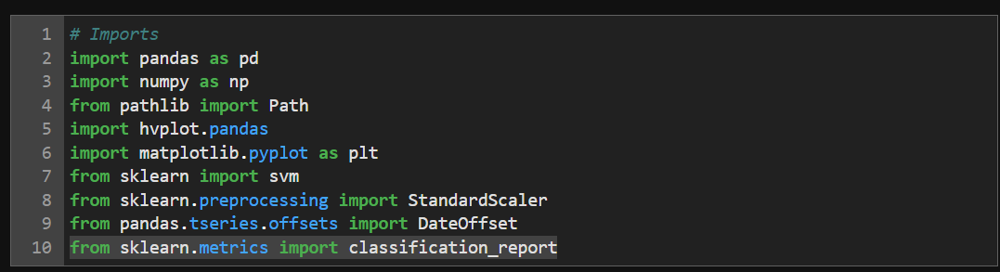
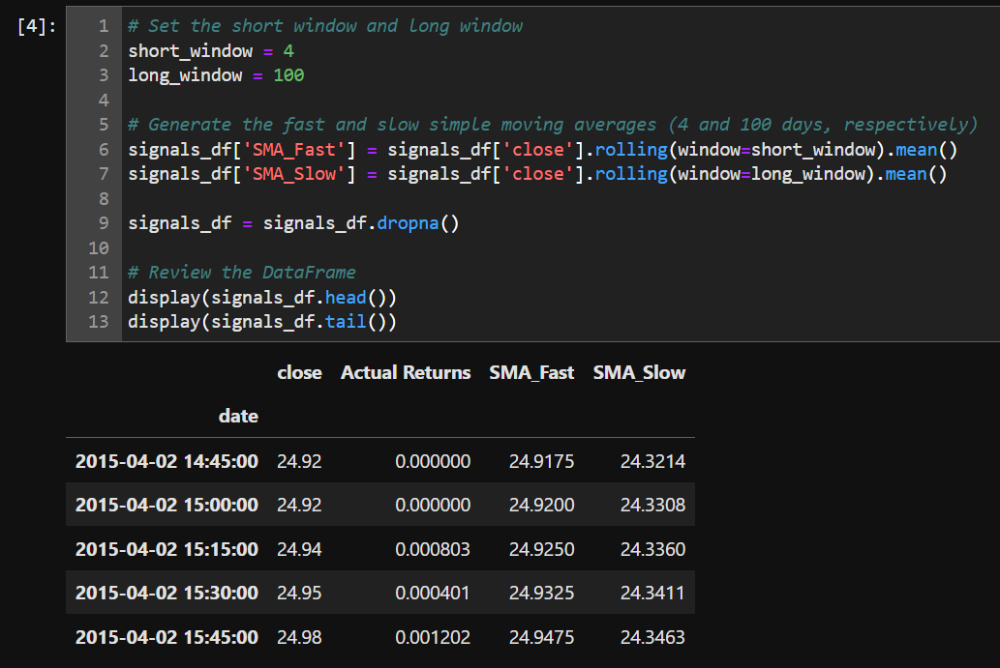
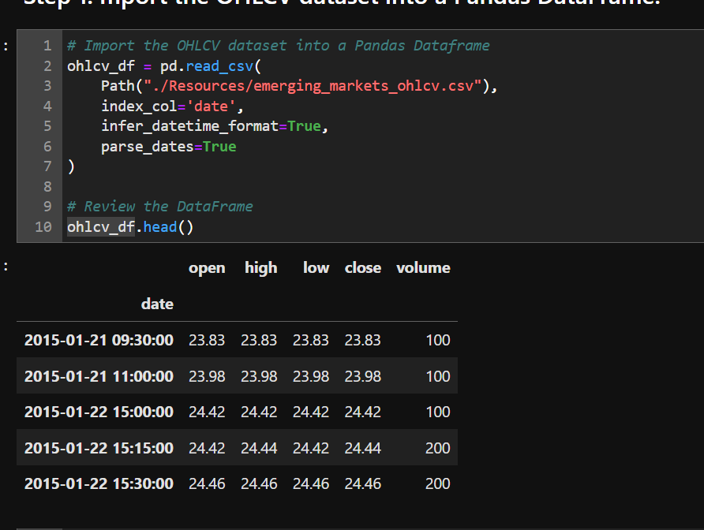
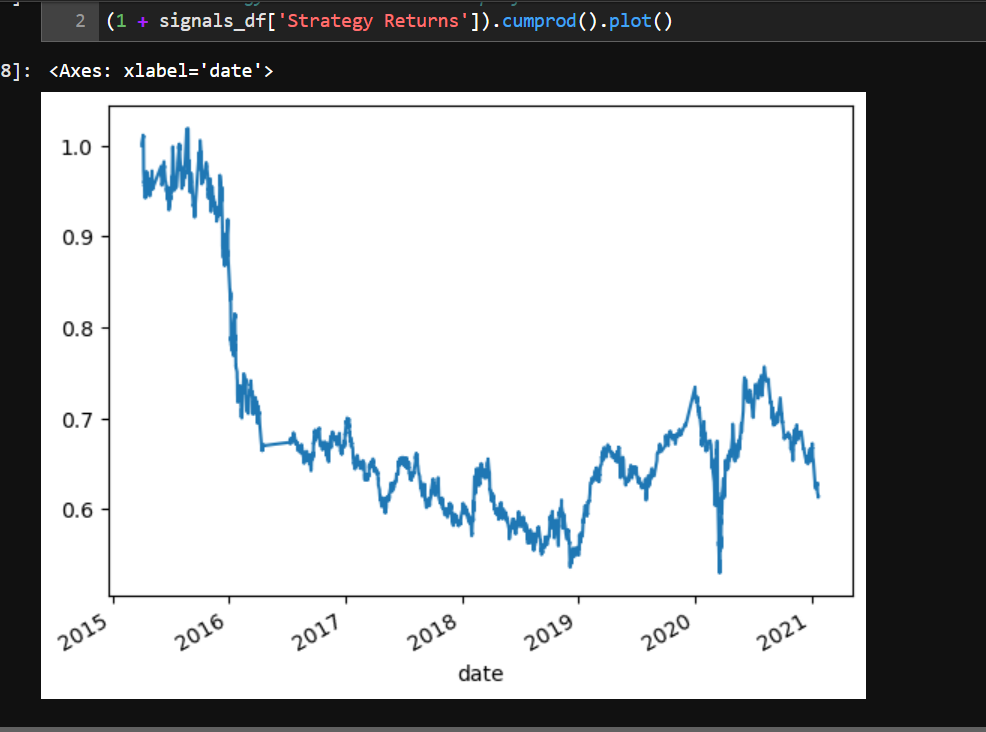
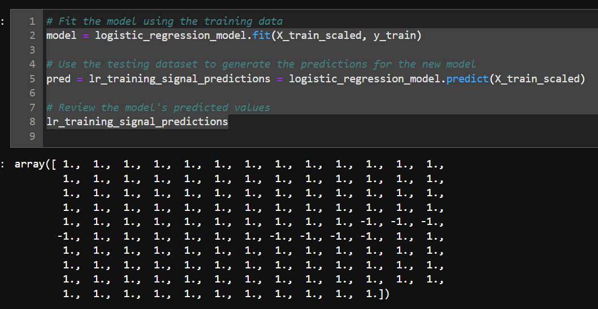
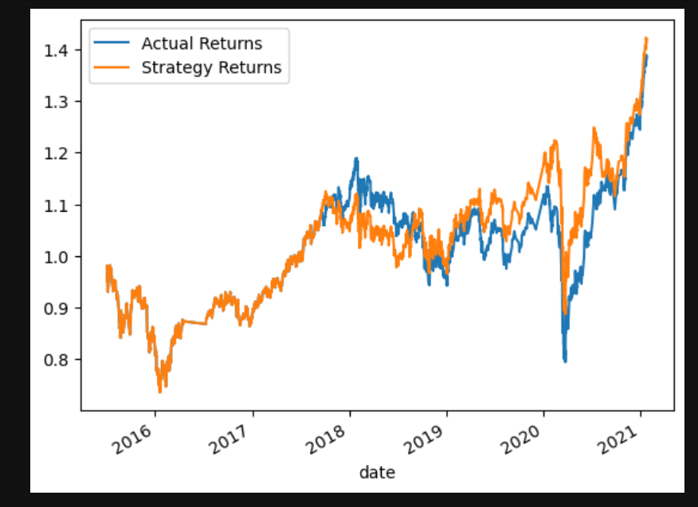

# Module_14_Challenge
# Machine Learning Trading Bot

Hello, this project is a machine learning trading bot is a software program that uses machine learning algorithms to make trading decisions in financial markets. It combines the power of machine learning techniques with real-time market data to analyze patterns, identify trends, and make predictions about the future movement of assets such as stocks, currencies, or commodities.

---

## Technologies

pandas is a software library written for the Python programming language for data manipulation and analysis. The machine learning trading bot typically learns from historical market data, incorporating various indicators, features, and patterns to train its predictive models. It can use supervised learning techniques, such as classification or regression, to predict market movements or unsupervised learning techniques, such as clustering or anomaly detection, to identify patterns or outliers.

## Installation Guide

Import the correct packages to begin coding.

---

## Usage

Use Plots and data frame to get the correct portfolio

---

## Contributors

-Name: John Nguyen
-Email: nguyenjohn1337@gmail.com

---

## License

Specify the details of your project’s license - that is, how others can or cannot use your code and files.
